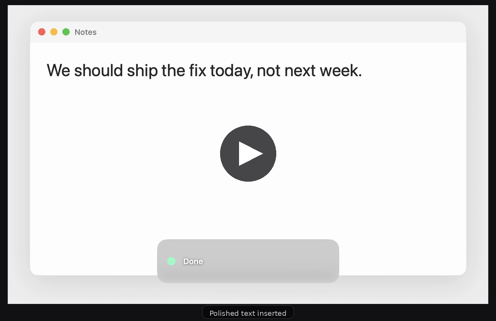

<p align="center">
  
</p>

# WhisperLocal

<p align="center">
  <a href="https://github.com/usingcolor/WhisperLocal/releases/latest"></a>
  <a href="https://github.com/usingcolor/WhisperLocal/releases"></a>
  
  <a href="LICENSE"></a>
</p>

<p align="center">
  <a href="https://github.com/usingcolor/WhisperLocal/releases/download/v0.2.0/WhisperLocal-0.2.0-arm64.dmg"><b>⬇&nbsp; Download 0.2.0 for Apple Silicon</b></a>
  &nbsp;·&nbsp;
  <a href="#usage">Usage</a>
  &nbsp;·&nbsp;
  <a href="#privacy">Privacy</a>
  &nbsp;·&nbsp;
  <a href="#contributing">Contributing</a>
</p>

**Dictation for Apple Silicon Macs that cleans up how you actually talk — without sending your voice anywhere.**

Hold a key, speak, let go. The filler words, false starts, and "period" / "comma" you said out loud get turned into real text, and it lands at your cursor in whatever app you were already in.

```
You say:   um so we should uh ship the fix today comma not next week period
You get:   We should ship the fix today, not next week.

You say:   so let's um move the meeting to 5 actually 6 period
You get:   Let's move the meeting to 6.

You say:   uh i i need to rewrite the the parser period
You get:   I need to rewrite the parser.
```

Your audio never leaves the Mac. Transcription and cleanup both run on-device by default.

<!-- GitHub serves a repo-hosted .mp4 as text/plain, so a <video> tag pointed here
     would not play. The poster links to the file instead, and GitHub's own blob
     viewer plays it. -->
<p align="center">
  <a href="assets/demo.mp4"></a>
  <br>
  <sub><a href="assets/demo.mp4"><b>▶ Watch the 21-second demo</b></a></sub>
</p>

> Early preview (`0.2.0`). It runs every day on one machine — more machines and more edge cases is exactly where help lands. See [Contributing](#contributing).

## Why not the dictation already built into macOS?

Built-in dictation types what you said. WhisperLocal types what you **meant**:

- **Fillers and false starts come out.** "um", "uh", "so I think", "wait no — actually" are removed or resolved to your final wording.
- **Spoken punctuation becomes punctuation.** "comma", "period", "new paragraph" turn into `,` `.` and line breaks — but "the Oxford comma" stays a phrase.
- **It sounds like you.** Cleanup fixes grammar and punctuation without upgrading your register, adding hedges, or padding a short note into a paragraph.
- **It works everywhere.** Text is inserted at the cursor in any app — editors, terminals, browsers, Electron apps.
- **It's genuinely offline.** No account, no server round-trip, no audio upload.

If you want Windows or Linux, streaming transcription, or a large model catalog, see [Related projects](#related-projects) — some of those will suit you better.

## Download

Apple Silicon only. No Xcode and no git clone required.

**[Download WhisperLocal 0.2.0](https://github.com/usingcolor/WhisperLocal/releases/download/v0.2.0/WhisperLocal-0.2.0-arm64.dmg)** (`.dmg`) — or browse [all releases](https://github.com/usingcolor/WhisperLocal/releases/latest).

1. Open the disk image and drag **WhisperLocal** into **Applications**.
2. Open it and grant **Microphone** and **Accessibility** when asked.

Releases are Developer ID signed, notarized, and stapled, so Gatekeeper lets them open. WhisperLocal lives in the menu bar — no Dock icon, no window to keep open. **Check for Updates** is in the menu, and verifies a SHA-256 checksum when a release publishes one.

<details>
<summary>Verifying a download, and opening older builds</summary>

Check against the `SHA256SUMS` published with each release:

```bash
shasum -a 256 ~/Downloads/WhisperLocal-*-arm64.dmg
```

**0.1.8** and earlier were ad-hoc signed. If macOS blocks one, use **System Settings → Privacy & Security → Open Anyway**, or:

```bash
xattr -dr com.apple.quarantine /Applications/WhisperLocal.app
```
</details>

## Usage

1. Put your cursor in any text field.
2. Hold **Globe / Fn**, speak, and release.
3. Cleaned text appears at the cursor.

**Esc** cancels — while recording, and while a take is still being transcribed. Long dictations are transcribed as you speak, so letting go is quick however long you talked. In Settings you can switch to tap-to-toggle, or move the hotkey to Right Option, Left Option, or Right Command.

**Shift** during a take stores a short session context instead of pasting — what you are working on, so later dictations resolve names and jargon. Press Shift again to switch back. The HUD shows an orange **CONTEXT** badge when a take will not be pasted. Not saved across launches.

## What you get on your macOS version

The defaults assume macOS 26. Older versions still work, with more setup:

| Your macOS | Transcription | Cleanup |
|---|---|---|
| **26 or later** | Apple Speech, built in — nothing to download | Apple Intelligence, on-device — nothing to download |
| **14 – 15** | Whisper `small.en`, downloaded on first use | Fillers stripped; turn on Gemma 4 (~2.7 GB) or a cloud API key for LLM polish |

Everything else is optional and switchable in Settings: other speech models (WhisperKit `tiny.en` / `base.en` / Large v3 Turbo, NVIDIA Parakeet TDT 0.6B v2), cloud cleanup, custom instructions, per-app rules, a personal dictionary, a local dictation log with JSON / CSV export, and whether WhisperLocal opens at login.

**Picking a cloud model.** Cloud cleanup is off unless you turn it on, and API keys live in the Keychain. If you do turn it on, `gpt-5.6-luna` is the one to start with — fast enough not to sit in the way, and cheap enough not to watch. In everyday use here, 189 requests came to 7 cents — a dollar would cover a couple of thousand. Most of that is output tokens, and over 60% of the input is served from the prompt cache, because the parts of the request that do not change from take to take are sent first. On-device polish is still faster, free, and keeps the text on your Mac.

## How it works

```
hold hotkey → record 16 kHz audio
           → Apple Speech            (default; or WhisperKit / Parakeet)
           → filler strip            (um / uh / hmm)
           → Apple Intelligence      (default; or Gemma 4 E2B IT; skipped when cloud cleanup is on)
           → OpenAI / Anthropic      (optional; replaces the on-device model)
           → insert at cursor
```

The cleanup step is **not a chatbot**. If you dictate a question, you get the question as text — it is never answered.

**Nothing is ever lost to a failure.** If cleanup fails or times out, the previous stage is pasted anyway. If the cloud is unreachable, the on-device model takes over. If the text cannot be typed, it is left on the clipboard for ⌘V. Long takes are transcribed in pieces, so one bad piece costs its own span rather than the whole recording.

Native Swift and AppKit. Transcription uses Apple's `SpeechTranscriber`, [WhisperKit](https://github.com/argmaxinc/argmax-oss-swift), or [NVIDIA Parakeet](https://huggingface.co/nvidia/parakeet-tdt-0.6b-v2) via [FluidAudio](https://github.com/FluidInference/FluidAudio). On-device cleanup uses Apple's `SystemLanguageModel` or Gemma 4 E2B IT through MLX. Insertion goes through the Accessibility API, falling back to clipboard ⌘V for terminals and Electron apps. There is no sidecar LLM process to install or run.

## Privacy

| | What leaves your Mac |
|---|---|
| **Default setup** | **Nothing.** Transcription and on-device cleanup all stay local. |
| Cloud cleanup, if you turn it on | Transcript **text** only, to OpenAI or Anthropic. Never audio. Recent dictations and session context go with the request if you enable them. |
| Audio | Never uploaded. Apple Speech writes a private temp `.caf` per take and deletes it right after; Whisper and Parakeet stay in memory. |
| Microphone indicator | The input graph stays open briefly after a take so the next one starts faster — about 2 seconds, or up to 45 for a Bluetooth headset used only as input. Nothing is recorded during that idle hold. |
| Keystrokes | The hotkey and Esc are observed through Accessibility. Never stored or logged. |
| Clipboard | Clipboard-paste mode briefly uses the general pasteboard, marked so clipboard managers skip it. |
| Dictation log | Optional and local only: `~/Library/Application Support/WhisperLocal/dictation-log.json`, mode `0600`, text with no audio. |

The app is **not sandboxed** — global hotkeys, Accessibility insertion, and synthetic paste all require that.

Security reports: see [SECURITY.md](SECURITY.md). Please don't file them as public issues.

## Contributing

Contributions are genuinely welcome, and this project is easier to work on than most Mac apps.

**The test suite is fast and needs nothing.** Unit tests run in about a quarter of a second — no microphone, no model download, no network, no API key:

```bash
brew install xcodegen   # once
xcodegen generate
xcodebuild test -scheme PolishTests -destination 'platform=macOS,arch=arm64'
```

Most of the interesting logic — text cleanup, prompt assembly, audio chunking, dictionary handling, log export — is pure functions covered by that suite. You can fix a real bug and prove it without ever launching the app.

**Good places to start:**

- **"WhisperLocal pastes wrong in *my* app."** Insertion quirks are hand-maintained lists in [`TextInserter.swift`](WhisperLocal/Services/TextInserter.swift) — often a one-line change. Bug reports are as useful as patches: tell us the app and what happened.
- **Cleanup that gets it wrong.** The prompt lives in [`CleanupPrompt.swift`](WhisperLocal/Services/Polishers/CleanupPrompt.swift). Paste what you said and what you expected.
- **Languages other than English.** English-only by design today. Broadening this is a real, well-scoped project.
- **Documentation.** If something here confused you, that's a bug in this file.

Before a PR: run `xcodegen generate` and the `PolishTests` scheme, add a test when you fix a behavior, keep changes focused, and never commit API keys or signing identities.

<details>
<summary>Project layout</summary>

```
WhisperLocal/
  App/         Info.plist, entitlements, app entry
  State/       DictationController, settings, dictation log
  Services/    recorder, transcription, hotkey, insertion, updater, polishers
  UI/          settings, HUD, onboarding, log
WhisperLocalTests/
project.yml    XcodeGen spec — regenerate after adding or moving files
```

Cleanup pipeline: filler strip → `LocalLLMPolisher` (Apple Foundation Models) or `GemmaMLXPolisher` (MLX) → optional `OpenAIPolisher` / `AnthropicPolisher`. The shared prompt lives in `CleanupPrompt.swift`.
</details>

## Build from source

Building it yourself sidesteps Gatekeeper entirely — a locally compiled app never gets a quarantine flag. The trade is setup cost: Xcode is a large download and the first build resolves around fifteen Swift packages, including MLX. For most people the [DMG](#download) is faster.

You need an Apple Silicon Mac, **Xcode 26 or later**, and [XcodeGen](https://github.com/yonaskolb/XcodeGen). Xcode 26 is required because mlx-swift 0.31.6 needs Swift 6.3 tools.

```bash
brew install xcodegen   # if needed
xcodegen generate
open WhisperLocal.xcodeproj
```

Set your own **Development Team** under Signing & Capabilities, then Run — this repo has no Apple team ID. Speech models are not in this repo; Whisper and Parakeet download from Hugging Face on first use.

<details>
<summary>Command-line build, the Dev app, and Accessibility troubleshooting</summary>

arm64 only — FluidAudio uses `Float16`, which x86_64 lacks:

```bash
xcodegen generate
xcodebuild -scheme WhisperLocal -configuration Release \
  -destination 'platform=macOS,arch=arm64' \
  -skipPackagePluginValidation -skipMacroValidation \
  ARCHS=arm64 VALID_ARCHS=arm64 EXCLUDED_ARCHS=x86_64 ONLY_ACTIVE_ARCH=YES \
  build
```

`bash scripts/make-dmg.sh` builds an ad-hoc signed Release DMG. Re-run `xcodegen generate` after changing `project.yml` or moving files.

**Public app and Dev app together.** Release installs as `/Applications/WhisperLocal.app` (`com.usingcolor.WhisperLocal`); Debug / `Dev` builds use `/Applications/WhisperLocal Dev.app` (`com.usingcolor.WhisperLocal.dev`), with separate settings, log, and TCC prompts. The Dev app skips Check for Updates and defaults its hotkey to Right Option.

```bash
DEVELOPMENT_TEAM=YourTeamID bash scripts/install-dev.sh
```

**If insertion stops working after a rebuild.** Use **Apple Development** signing for local installs — ad-hoc builds often make Accessibility read as "Missing." Then: System Settings → Privacy & Security → Accessibility, remove WhisperLocal, add it back, and reopen from the menu bar. The onboarding window shows the exact binary path.
</details>

## Supporting this project

WhisperLocal is free and MIT licensed, and it stays that way. Nothing is paywalled, no feature is held back, and there is no paid tier — sponsoring only says the work is worth continuing.

If it saves you typing, you can [sponsor it on GitHub](https://github.com/sponsors/usingcolor) — one-off or monthly, any amount. There is also [Buy Me a Coffee](https://buymeacoffee.com/usingcolor) if you prefer that. If you would rather not, that is genuinely fine: filing a good bug report is worth more than a dollar.

## Related projects

Worth a look if WhisperLocal isn't the right shape for you:

- [Handy](https://github.com/cjpais/Handy) — cross-platform offline speech-to-text
- [VoiceInk](https://github.com/Beingpax/VoiceInk) — Mac dictation with Modes and many enhancement backends
- [OpenWhispr](https://github.com/OpenWhispr/openwhispr) — cross-platform dictation with in-app llama.cpp cleanup

## License

Application source is [MIT](LICENSE).

Speech and language model weights are **not** covered by that license and are downloaded separately — see [NOTICE](NOTICE). Parakeet TDT 0.6B v2 is NVIDIA CC-BY-4.0 (attribution, not copyleft). Gemma 4 is Apache 2.0 and downloads only if you select it. Please don't describe those files as MIT.
