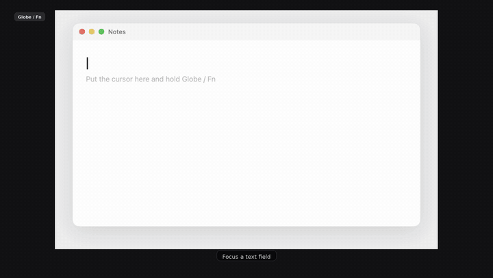

<p align="center">
  
</p>

# WhisperLocal

**Dictation for Apple Silicon Macs that cleans up how you actually talk — without sending your voice anywhere.**

Hold a key, speak, let go. The filler words, false starts, and "period" / "comma" you said out loud get turned into real text, and it lands at your cursor in whatever app you were already in.

```
You say:   um so we should uh ship the fix today comma not next week period
You get:   We should ship the fix today, not next week.

You say:   so let's um move the meeting to 5 actually 6 period
You get:   Let's move the meeting to 6.

You say:   uh i i need to rewrite the the parser period
You get:   I need to rewrite the parser.
```

Your audio never leaves the Mac. Transcription and cleanup both run on-device by default.

<!-- TODO: replace with a ~5s screen recording: hold Globe/Fn → HUD appears → cleaned text lands in a text field. -->
<!-- <p align="center"></p> -->

> Early preview (`0.1.6`). It runs every day on one machine — more machines and more edge cases is exactly where help lands. See [Contributing](#contributing).

## Why not the dictation already built into macOS?

Built-in dictation types what you said. WhisperLocal types what you **meant**:

- **Fillers and false starts come out.** "um", "uh", "so I think", "wait no — actually" are removed or resolved to your final wording.
- **Spoken punctuation becomes punctuation.** "comma", "period", "new paragraph" turn into `,` `.` and line breaks — but "the Oxford comma" stays a phrase.
- **It sounds like you.** Cleanup fixes grammar and punctuation without upgrading your register, adding hedges, or padding a short note into a paragraph.
- **It works everywhere.** Text is inserted at the cursor in any app — editors, terminals, browsers, Electron apps.
- **It's genuinely offline.** No account, no server round-trip, no audio upload.

If you want Windows or Linux, streaming transcription, or a large model catalog, see [Related projects](#related-projects) — some of those will suit you better.

## Download

Apple Silicon only. Grab the DMG from [Releases](https://github.com/usingcolor/WhisperLocal/releases/latest) — no Xcode and no git clone required.

1. Open the disk image and drag **WhisperLocal** into **Applications**.
2. First launch: **System Settings → Privacy & Security → Open Anyway**. The build is ad-hoc signed and not Apple-notarized, so Gatekeeper warns once.
3. Grant **Microphone** and **Accessibility** when asked.

WhisperLocal lives in the menu bar — there's no Dock icon and no window to keep open. **Check for Updates** is in the menu.

## Usage

1. Put your cursor in any text field.
2. Hold **Globe / Fn**, speak, and release.
3. Cleaned text appears at the cursor.

**Esc** cancels a dictation in progress. In Settings you can switch to tap-to-toggle, or move the hotkey to Right Option, Left Option, or Right Command.

## What you get on your macOS version

The defaults assume macOS 26. Older versions still work, with more setup:

| Your macOS | Transcription | Cleanup |
|---|---|---|
| **26 or later** | Apple Speech, built in — nothing to download | Apple Intelligence, on-device — nothing to download |
| **14 – 15** | Whisper `small.en`, downloaded on first use | Fillers stripped; turn on heuristic, Gemma 4 (~2.7 GB), or a cloud API key for more cleanup |

Everything below the defaults is optional and switchable in Settings.

## Features

- Menu-bar agent — no Dock icon, no window to manage
- Global hotkey, hold-to-talk or tap-to-toggle; **Esc** cancels
- On-device English transcription: Apple Speech, or WhisperKit (`tiny.en` / `base.en` / `small.en` / Large v3 Turbo), or NVIDIA Parakeet TDT 0.6B v2
- On-device cleanup: optional heuristics, then Apple Intelligence or Gemma 4 E2B IT
- Optional OpenAI or Anthropic cleanup — **transcript text only**, keys stored in the Keychain
- Editable custom instructions, per-app rules, and a personal dictionary for names and jargon
- Fail-open: if cleanup fails or times out, the previous stage is pasted anyway — you never lose a dictation
- Smart insertion: Accessibility API first, clipboard ⌘V for terminals and Electron apps that need it
- Optional dictation log (text only, never audio) with JSON / CSV / plain-text export
- Floating recording HUD with a live input meter
- In-app updates from GitHub Releases, with SHA-256 verification when a release publishes checksums

## How it works

```
hold hotkey → record 16 kHz audio
           → Apple Speech            (default; or WhisperKit / Parakeet)
           → heuristic cleanup       (optional; fillers, self-corrections, spoken punctuation, dictionary)
           → Apple Intelligence      (default; or Gemma 4 E2B IT; skipped when cloud cleanup is on)
           → OpenAI / Anthropic      (optional; replaces the on-device model)
           → insert at cursor
```

The cleanup step is **not a chatbot**. If you dictate a question, you get the question as text — it is never answered.

Native Swift and AppKit. Transcription uses Apple's `SpeechTranscriber`, [WhisperKit](https://github.com/argmaxinc/argmax-oss-swift), or [NVIDIA Parakeet](https://huggingface.co/nvidia/parakeet-tdt-0.6b-v2) via [FluidAudio](https://github.com/FluidInference/FluidAudio). On-device cleanup uses Apple's `SystemLanguageModel` or Gemma 4 E2B IT through MLX. There is no sidecar LLM process to install or run.

On-device cleanup waits up to 20 s; cloud cleanup waits up to 30 s. A timeout pastes the previous stage rather than hanging.

## Settings

| Setting | Default |
|---|---|
| Speech model | Apple Speech (macOS 26); falls back to Whisper `small.en`. Also `tiny.en`, `base.en`, Large v3 Turbo, Parakeet TDT 0.6B v2 |
| Text cleanup | On |
| Heuristic cleanup | Off — optional extra pass before the model |
| On-device cleanup | Apple Intelligence, or Gemma 4 E2B IT; skipped automatically while cloud cleanup is on |
| Cloud cleanup | Off (OpenAI / Anthropic; pick a model in Settings) |
| Recent dictations in polish | Off. Optional; you choose 1–8 previous takes. Not written into the system prompt. |
| Custom instructions | Generic starter notes; edit or clear in Settings |
| Dictionary | Editable list, with CSV import |
| Trailing space after paste | On |

API keys live in the Keychain under `com.usingcolor.WhisperLocal`.

## Privacy

| | What leaves your Mac |
|---|---|
| **Default setup** | **Nothing.** Transcription, heuristic cleanup, and on-device cleanup all stay local. |
| Cloud cleanup, if you turn it on | Transcript **text** only, to OpenAI or Anthropic. Never audio. If you also turn on recent dictations in polish, those earlier takes (text) go with the request. |
| Audio | Never uploaded. Apple Speech writes a private temp `.caf` per take and deletes it right after; Whisper and Parakeet stay in memory. |
| Microphone indicator | After you let go, the input graph stays open briefly so the next take starts faster. Built-in mics drop it after about 2 seconds. A Bluetooth headset used only as input can stay open up to 45 seconds — the orange Control Center dot stays lit. If those headphones are also playing audio, the graph drops after 2 seconds so they can leave the hands-free profile. Nothing is recorded or uploaded during that idle hold. |
| Keystrokes | The hotkey and Esc are observed through Accessibility. Keystrokes are never stored or logged. |
| Clipboard | Clipboard-paste mode briefly uses the general pasteboard, marked so clipboard managers skip it. |
| Dictation log | Optional, off-switchable, local only: `~/Library/Application Support/WhisperLocal/dictation-log.json`, mode `0600`, text with no audio. Polish does not read it unless you enable recent dictations in polish. |

The app is **not sandboxed** — global hotkeys, Accessibility insertion, and synthetic paste all require that.

Security reports: see [SECURITY.md](SECURITY.md). Please don't file them as public issues.

## Contributing

Contributions are genuinely welcome, and this project is easier to work on than most Mac apps.

**The test suite is fast and needs nothing.** 103 tests run in about a tenth of a second — no microphone, no model download, no network, no API key:

```bash
brew install xcodegen   # once
xcodegen generate
xcodebuild test -scheme PolishTests -destination 'platform=macOS,arch=arm64'
```

Most of the interesting logic — text cleanup, prompt assembly, dictionary handling, log export — is pure functions covered by that suite. You can fix a real bug and prove it without ever launching the app.

### Good places to start

- **"WhisperLocal pastes wrong in *my* app."** Insertion quirks are handled by hand-maintained lists in [`TextInserter.swift`](WhisperLocal/Services/TextInserter.swift). Adding an app is often a one-line change. Bug reports here are just as useful as patches — tell us the app and what happened.
- **Cleanup that gets it wrong.** [`HeuristicPolisher.swift`](WhisperLocal/Services/Polishers/HeuristicPolisher.swift) is pure, self-contained, and heavily tested. If it mangles a phrase you dictate often, that's a great first issue — paste what you said and what you expected.
- **Languages other than English.** Currently English-only by design. Broadening this is a real, well-scoped project.
- **Documentation.** If something here confused you, that's a bug in this file.

### Before opening a PR

- Run `xcodegen generate` and the `PolishTests` scheme; add a test when you fix a behavior
- Keep changes focused — one concern per PR
- Never commit API keys, signing identities, or personal dictionary contents

### Project layout

```
WhisperLocal/
  App/         Info.plist, entitlements, app entry
  State/       DictationController, settings, dictation log
  Services/    recorder, transcription, hotkey, insertion, updater, polishers
  UI/          settings, HUD, onboarding, log
WhisperLocalTests/
project.yml    XcodeGen spec — regenerate after adding or moving files
```

Cleanup pipeline: `HeuristicPolisher` → `LocalLLMPolisher` (Apple Foundation Models) or `GemmaMLXPolisher` (MLX) → optional `OpenAIPolisher` / `AnthropicPolisher`. The shared prompt lives in `CleanupPrompt.swift`.

## Build from source

You need an Apple Silicon Mac, **Xcode 26 or later**, and [XcodeGen](https://github.com/yonaskolb/XcodeGen). Xcode 26 is required because mlx-swift 0.31.6 needs Swift 6.3 tools — Xcode 16.4 ships Swift 6.1 and cannot resolve the package.

```bash
brew install xcodegen   # if needed
xcodegen generate
open WhisperLocal.xcodeproj
```

In Xcode, set your own **Development Team** under Signing & Capabilities, then Run. This repo does not include an Apple team ID.

Command line (arm64 only — FluidAudio uses `Float16`, which x86_64 lacks):

```bash
xcodegen generate
xcodebuild -scheme WhisperLocal -configuration Release \
  -destination 'platform=macOS,arch=arm64' \
  -skipPackagePluginValidation -skipMacroValidation \
  ARCHS=arm64 VALID_ARCHS=arm64 EXCLUDED_ARCHS=x86_64 ONLY_ACTIVE_ARCH=YES \
  build
```

Build a Release DMG with `bash scripts/make-dmg.sh`. Re-run `xcodegen generate` after changing `project.yml` or moving files.

Speech models are not in this repo — Whisper and Parakeet download from Hugging Face into the engine cache on first use.

### Signing and Accessibility

Use **Apple Development** signing for local installs. Ad-hoc and hardened-runtime-only builds often make Accessibility read as "Missing."

If insertion stops working after a rebuild:

1. System Settings → Privacy & Security → Accessibility
2. Remove WhisperLocal, then add it back
3. Quit and reopen from the menu bar

The onboarding window shows the exact binary path that needs to be enabled.

## Related projects

Worth a look if WhisperLocal isn't the right shape for you:

- [Handy](https://github.com/cjpais/Handy) — cross-platform offline speech-to-text
- [VoiceInk](https://github.com/Beingpax/VoiceInk) — Mac dictation with Modes and many enhancement backends
- [OpenWhispr](https://github.com/OpenWhispr/openwhispr) — cross-platform dictation with in-app llama.cpp cleanup

## License

Application source is [MIT](LICENSE).

Speech and language model weights are **not** covered by that license and are downloaded separately — see [NOTICE](NOTICE). Parakeet TDT 0.6B v2 is NVIDIA CC-BY-4.0 (attribution, not copyleft). Gemma 4 is Apache 2.0 and downloads only if you select it. Please don't describe those files as MIT.
