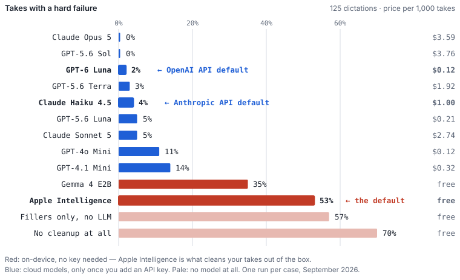

<p align="center">
  
</p>

# WhisperLocal

<p align="center">
  <a href="https://github.com/usingcolor/WhisperLocal/releases/latest"></a>
  <a href="https://github.com/usingcolor/WhisperLocal/releases"></a>
  
  <a href="LICENSE"></a>
</p>

<p align="center">
  <a href="https://github.com/usingcolor/WhisperLocal/releases/download/v0.2.5/WhisperLocal-0.2.5-arm64.dmg"><b>⬇&nbsp; Download 0.2.5 for Apple Silicon</b></a>
  &nbsp;·&nbsp;
  <a href="#usage">Usage</a>
  &nbsp;·&nbsp;
  <a href="#privacy">Privacy</a>
  &nbsp;·&nbsp;
  <a href="#contributing">Contributing</a>
</p>

<p align="center">
  
  <br>
  <sub>Illustrative animation of automatic context.</sub>
</p>

**Dictation for Apple Silicon Macs that cleans up how you actually talk — without sending your voice anywhere.**

Hold a key, speak, let go. The filler words, false starts, and "period" / "comma" you said out loud get turned into real text, and it lands at your cursor in whatever app you were already in.

```
You say:   um so we should uh ship the fix today comma not next week period
You get:   We should ship the fix today, not next week.

You say:   so let's um move the meeting to 5 actually 6 period
You get:   Let's move the meeting to 6.

You say:   uh i i need to rewrite the the parser period
You get:   I need to rewrite the parser.
```

Your audio stays on the Mac. Transcription and cleanup run on-device by default; initial model downloads may need an internet connection. Cloud cleanup is optional and sends text to your selected provider.

> Early preview (`0.2.5`). It runs every day on one machine — more machines and more edge cases is exactly where help lands. See [Contributing](#contributing).

## Why not the dictation already built into macOS?

Built-in dictation types what you said. WhisperLocal types what you **meant**:

- **Fillers and false starts come out.** "um", "uh", "so I think", "wait no — actually" are removed or resolved to your final wording.
- **Spoken punctuation becomes punctuation.** "comma", "period", "new paragraph" turn into `,` `.` and line breaks — but "the Oxford comma" stays a phrase.
- **It sounds like you.** Cleanup fixes grammar and punctuation without upgrading your register, adding hedges, or padding a short note into a paragraph.
- **It works across apps.** Text is inserted at the cursor in editors, terminals, browsers and Electron apps, with a clipboard fallback when insertion cannot be confirmed.
- **On-device dictation works offline.** After the required models are downloaded, no cloud account or audio upload is needed.

If you want Windows or Linux, streaming transcription, or a large model catalog, see [Related projects](#related-projects) — some of those will suit you better.

## Download

Apple Silicon only. No Xcode and no git clone required.

**[Download WhisperLocal 0.2.5](https://github.com/usingcolor/WhisperLocal/releases/download/v0.2.5/WhisperLocal-0.2.5-arm64.dmg)** (`.dmg`) — or browse [all releases](https://github.com/usingcolor/WhisperLocal/releases/latest).

1. Open the disk image and drag **WhisperLocal** into **Applications**.
2. Open it and grant **Microphone**, **Accessibility**, and **Input Monitoring** when asked. The onboarding window and Settings → Permissions show what is missing.

Releases are Developer ID signed, notarized, and stapled, so Gatekeeper lets them open. WhisperLocal lives in the menu bar — no Dock icon, no window to keep open. **Check for Updates** is in the menu, and verifies a SHA-256 checksum when a release publishes one.

<details>
<summary>Verify your download</summary>

Each release page prints the SHA-256 of its DMG at the bottom of the notes. Compare it with:

```bash
shasum -a 256 ~/Downloads/WhisperLocal-*-arm64.dmg
```

</details>

## Usage

1. Put your cursor in any text field.
2. Hold **Globe / Fn**, speak, and release.
3. Cleaned text appears at the cursor.

**Esc**, or the ✕ on the recording toolbar, cancels while recording, transcribing, or cleaning up a take. Long dictations are transcribed in chunks as you speak, reducing the work left when you let go. Settings → Dictation → Hotkey lets you switch to tap-to-toggle, or choose Right Option, Left Option, or Right Command.

**Shift** during a take stores a short session context instead of pasting — what you are working on, so later dictations can resolve names and jargon. Press Shift again to switch back. The recording toolbar says “context” and turns its recording dot orange when a take will not be pasted. Shift context clears after 45 minutes without use; Apple Intelligence can also clear it after three consecutive unrelated takes when no typed or corrected topics are present. It is not restored across launches.

**Context** brings Shift dictation, automatic topics, and typed notes into one readable, editable list. Open **Edit Context…** from the menu bar or press **Control + Shift + K** between takes; the shortcut can be changed under Settings → Dictation → Hotkey → Open Context. Save with **Command + Return**, or discard unsaved changes with **Escape**. Correcting an automatic topic protects your wording from later learning. You can keep up to six typed or corrected topics; they stay until removed or the app quits, including when automatic learning is turned off. Shift context keeps its own expiry rules. The recording toolbar shows a summary of active context and a button to open the editor.

**Automatic context** keeps up to three short topics, then uses them with later dictations. Learning runs after the paste, with text cleanup enabled and Apple Intelligence or your selected cloud cleanup provider. Automatic topics fade after more than 15 unused takes or 45 minutes, and a fourth topic replaces the least recently used one. Learning is on by default; turn it off in Context or Settings → Polish. Active context clears when the app quits. The local dictation log can retain topic snapshots and update history; clearing Context does not erase those log entries.

Apple Intelligence learns names containing capitals or digits. For names written only in Korean, Japanese or Chinese scripts, add or correct a note in Context. Gemma can use your notes but does not learn automatic topics. With cloud cleanup, the take, context and app name go to the selected provider; learning makes an additional request to that provider. Audio stays on your Mac.

## What you get on your macOS version

The defaults prefer Apple's on-device models when they are available. Older macOS versions need downloaded models for transcription and LLM cleanup:

| Your macOS | Transcription | Cleanup |
|---|---|---|
| **26 or later** | Apple Speech when available; macOS may download its language models | Apple Intelligence when enabled and ready; otherwise filler stripping until a working cleanup engine is selected |
| **14 – 15** | Whisper `small.en`, downloaded on first use | Fillers stripped; turn on Gemma 4 (~2.7 GB) or a cloud API key for LLM polish |

Apple Intelligence also needs its system model to be installed. If Apple Speech is unavailable, the default transcription model is Whisper `small.en`.

Settings offers Whisper `small.en`, Whisper Large v3 Turbo, and NVIDIA Parakeet TDT 0.6B v2 alongside Apple Speech. Tiny and Base remain available only for existing saved selections. Other choices include cloud cleanup, custom instructions, per-app dictionaries and rules, a local dictation log with JSON / CSV export, and opening WhisperLocal at login.

**Dictating in another language.** Choose one under Settings → Language, or enable the keyboard languages you want the app to follow. New public installs start in English and do not follow keyboard languages until you select them. Apple Speech supports the locales available on your Mac; Whisper Large v3 Turbo is multilingual, while `small.en` and Parakeet v2 are English-only. The selected cleanup engine must also support the language. The toolbar shows the language before you speak. If a language is unavailable or its model is still downloading, the take falls back to your configured default language, then English if needed.

**Choosing a microphone.** The microphone button on the recording toolbar opens the list — hover it to see which one is in use; the same list is in the menu bar and in Settings › Dictation. Picking one mid-take switches it without ending the take. Left alone, takes follow System Settings — except when the default input is a Bluetooth headset that is also playing, where takes use the built-in or a wired mic instead, because opening a headset's microphone drops its playback to narrowband and changes its volume.

**Moving the recording toolbar.** It opens at the bottom centre of the screen, which is where many chat apps keep the box you type into. Settings › General › Recording toolbar moves it to the top centre or a bottom corner. Turn on “Let me drag it” to put it anywhere; right-click the toolbar to reset it.

**Toolbar transparency.** Settings › General › Recording toolbar has a Background opacity slider. It starts at 90%; 0% removes the glass background, and 100% restores full glass. Lower values show more of the desktop but can make toolbar content harder to read over busy backgrounds. macOS Reduce Transparency and Increase Contrast preferences keep the material at full strength.

**Picking a cleanup engine.** Apple Intelligence is the default on-device choice when it is available. Gemma 4 is an optional local download. To use cloud cleanup, choose Cloud under Settings → Polish, select OpenAI or Anthropic, and add an API key; keys are kept in the Keychain. New OpenAI selections default to GPT-6 Luna, and Anthropic selections to Claude Haiku 4.5. Existing saved model choices are kept.

The table below is a September 2026 snapshot from the [polish benchmark](Benchmarks/README.md): 125 scripted transcripts, including 22 Korean cases, cleaned through the app's polishing code and compared head to head by a judge model. It measures text cleanup, not speech recognition or automatic context, and has not been rerun for every 0.2.5 change.

<picture>
  <source media="(prefers-color-scheme: dark)" srcset="assets/polish-benchmark-dark.svg">
  
</picture>

| Cleanup engine | Takes with a hard failure | Judged against GPT-4o Mini | Typical wait | Per 1,000 takes |
|---|---|---|---|---|
| **GPT-6 Luna** — the OpenAI API default | 2% | **55%** | 1.3s | **$0.12** |
| GPT-5.6 Luna | 5% | **55%** | 1.1s | $0.21 |
| GPT-5.6 Sol | **0%** | **55%** | 1.2s | $3.76 |
| Claude Opus 5 | **0%** | 54% | 1.5s | $3.59 |
| GPT-5.6 Terra | 3% | 54% | 1.1s | $1.92 |
| **Claude Haiku 4.5** — the Anthropic API default | 4% | 50% | **0.8s** | $1.00 |
| Claude Sonnet 5 | 5% | 49% | 1.2s | $2.74 |
| GPT-4o Mini | 11% | — | **0.6s** | **$0.12** |
| GPT-4.1 Mini | 14% | 46% | 0.7s | $0.32 |
| Gemma 4 E2B — on-device | 35% | 29% | 0.8s | free |
| **Apple Intelligence** — on-device, the default with no key | 53% | 14% | 1.3s | free |
| Filler stripping only — no LLM | 57% | 12% | — | free |
| Nothing at all | 70% | — | — | free |

**Bold marks the best figure in each column.** The names in bold are what the app preselects: Apple Intelligence out of the box, and one model per cloud provider once you add a key. A **hard failure** is one a script can prove: answering a dictated question instead of cleaning it, switching language, dropping what you said, adding a preamble, or misspelling a word from your dictionary. **Judged** is the share of head-to-head comparisons a judge model preferred, with every pair shown in both orders — 50% is a tie with GPT-4o Mini. Prices are published list prices checked 12 September 2026, and GPT-6 Luna's on 26 September, when it was run on the same cases; the free engines are left out of that comparison.

**Reading the results.** In this run, cloud engines had fewer hard failures than the on-device engines, while their judge scores were close. On-device cleanup keeps text local and has no API charge. Waits and costs depend on transcript length, hardware, caching and provider pricing. The cost column covers benchmark cleanup requests; the additional cloud request for automatic context is not included.

One run per case, one judge, and the cases were written by the same person who wrote the app, so treat the table as a guide rather than a verdict. [How to run it yourself](Benchmarks/README.md), including on your own cases.

## How it works

```
hold hotkey → record 16 kHz audio
           → transcribe: Apple Speech / WhisperKit / Parakeet
           → strip fillers when cleanup is enabled
           → clean text: Apple Intelligence / Gemma / selected cloud provider
           → insert at cursor, with clipboard fallback
after paste → learn automatic topics when enabled and supported
```

The cleanup step is instructed to preserve your words and keep dictated questions as text.

**Cleanup failures preserve the transcript.** If cleanup fails or times out, the app uses the text from the previous stage. A cloud failure falls back to the on-device model when it is ready; otherwise the filler-stripped transcript is used. If insertion cannot be confirmed, the toolbar tells you when the text is on the clipboard for ⌘V. Long takes are transcribed in pieces so successful chunks can survive a failed chunk; transcription errors can still leave gaps.

Native Swift and AppKit. Transcription uses Apple's `SpeechTranscriber`, [WhisperKit](https://github.com/argmaxinc/argmax-oss-swift), or [NVIDIA Parakeet](https://huggingface.co/nvidia/parakeet-tdt-0.6b-v2) via [FluidAudio](https://github.com/FluidInference/FluidAudio). On-device cleanup uses Apple's `SystemLanguageModel` or Gemma 4 E2B IT through MLX. Insertion goes through the Accessibility API, falling back to clipboard ⌘V for terminals and Electron apps. There is no sidecar LLM process to install or run.

## Privacy

| | What leaves your Mac |
|---|---|
| **Default setup** | Audio and transcripts stay on your Mac. Model downloads and update checks use the network. |
| Cloud cleanup, if you turn it on | Transcript text, the target app name/type, and your configured dictionary and instructions go to OpenAI or Anthropic. Active context is included; recent dictations are included only when enabled. Audio is not sent. |
| Automatic context with cloud cleanup | An additional request sends the cleaned take, active topics and app name/type to the same provider. Turn learning off in Context or Settings → Polish to stop these updates. |
| Audio | Never uploaded. Apple Speech writes a private temp `.caf` per take and deletes it right after; Whisper and Parakeet stay in memory. |
| Microphone indicator | The input graph stays open briefly after a take so the next one starts faster — about 2 seconds, or up to 45 for a Bluetooth headset used only as input. Nothing is recorded during that idle hold. |
| Keyboard events | Observed for dictation, Shift, Esc and the Context shortcut using the granted keyboard permissions. Typed text is not stored or logged. |
| Clipboard | Paste mode uses the general pasteboard, marked concealed/transient for clipboard managers that honor those markers. Unconfirmed insertion can leave the dictation there for ⌘V. |
| Dictation log | Local and enabled by default; keeps up to 100 entries, including transcripts, app/model/microphone details and context snapshots, with no audio. Stored at `~/Library/Application Support/WhisperLocal/dictation-log.json`, mode `0600`. Turn it off under Settings → Dictation → History; use the log window to clear existing entries. |

Active context is not restored on launch, but its snapshots can remain in the local log. The public 0.2.5 app does not include volunteer log submissions or window-title capture.

The app is **not sandboxed** — global hotkeys, Accessibility insertion, and synthetic paste all require that.

Security reports: see [SECURITY.md](SECURITY.md). Please don't file them as public issues.

## Contributing

Contributions are genuinely welcome, and this project is easier to work on than most Mac apps.

**Unit tests do not need a microphone, model weights, or API keys.** The first build resolves Swift dependencies. An optional volunteer-sharing integration test is skipped unless you provide a local test server:

```bash
brew install xcodegen   # once
xcodegen generate
xcodebuild test -scheme PolishTests -destination 'platform=macOS,arch=arm64' \
  -skipPackagePluginValidation -skipMacroValidation \
  CODE_SIGNING_ALLOWED=NO CODE_SIGNING_REQUIRED=NO
```

Most of the interesting logic — text cleanup, prompt assembly, audio chunking, dictionary handling, log export — is pure functions covered by that suite. You can fix a real bug and prove it without ever launching the app.

**Good places to start:**

- **"WhisperLocal pastes wrong in *my* app."** Insertion quirks are hand-maintained lists in [`TextInserter.swift`](WhisperLocal/Services/TextInserter.swift) — often a one-line change. Bug reports are as useful as patches: tell us the app and what happened.
- **Cleanup that gets it wrong.** The prompt lives in [`CleanupPrompt.swift`](WhisperLocal/Services/Polishers/CleanupPrompt.swift). Paste what you said and what you expected.
- **More dictation languages.** Language support depends on the selected transcription and cleanup engines. The benchmark has 103 English and 22 Korean cases; other languages need more coverage. Adding cases is as useful as code.
- **Documentation.** If something here confused you, that's a bug in this file.

Before a PR: run `xcodegen generate` and the `PolishTests` scheme, add a test when you fix a behavior, keep changes focused, and never commit API keys or signing identities.

<details>
<summary>Project layout</summary>

```
WhisperLocal/
  App/         Info.plist, entitlements, app entry
  State/       DictationController, settings, dictation log
  Services/    recorder, transcription, hotkey, insertion, updater, polishers
  UI/          settings, HUD, onboarding, log
WhisperLocalTests/
project.yml    XcodeGen spec — regenerate after adding or moving files
```

Cleanup pipeline: filler strip → the selected on-device or cloud polisher. Cloud failures can use a ready on-device model as fallback. The shared prompt lives in `CleanupPrompt.swift`.
</details>

## Build from source

You can build and run WhisperLocal locally with Xcode. The first build resolves Swift dependencies, including MLX. For most people the [DMG](#download) is faster.

You need an Apple Silicon Mac, **Xcode 26.4 or later**, and [XcodeGen](https://github.com/yonaskolb/XcodeGen). mlx-swift 0.31.6 needs Swift 6.3, which is included starting with [Xcode 26.4](https://developer.apple.com/documentation/xcode-release-notes/xcode-26_4-release-notes).

```bash
brew install xcodegen   # if needed
xcodegen generate
open WhisperLocal.xcodeproj
```

Set your own **Development Team** under Signing & Capabilities, then Run — this repo has no Apple team ID. Speech models are not in this repo; Whisper and Parakeet download from Hugging Face on first use.

<details>
<summary>Command-line build, the Dev app, and Accessibility troubleshooting</summary>

arm64 only — FluidAudio uses `Float16`, which x86_64 lacks:

```bash
xcodegen generate
xcodebuild -scheme WhisperLocal -configuration Release \
  -destination 'platform=macOS,arch=arm64' \
  -skipPackagePluginValidation -skipMacroValidation \
  ARCHS=arm64 VALID_ARCHS=arm64 EXCLUDED_ARCHS=x86_64 ONLY_ACTIVE_ARCH=YES \
  build
```

`bash scripts/make-dmg.sh` packages a Release DMG and checks the app for embedded personal Mac account paths. Local builds containing those paths are blocked from packaging; use the manual Release workflow on GitHub Actions for a distribution DMG. The local app build above remains available. Re-run `xcodegen generate` after changing `project.yml` or moving files.

CI runs the regression suite and compiles the complete Apple Silicon app and both benchmark tools on pull requests and pushes to `main` or `oss`. Tagged release builds also run the tests and require all six Apple signing and notarization secrets listed in `.github/workflows/release.yml`; they create a draft for maintainer publication. Manual Release workflow runs produce build artifacts, with signing and notarization when the secrets are available, and can use ad-hoc signing otherwise.

**Public app and Dev app together.** Release installs as `/Applications/WhisperLocal.app` (`com.usingcolor.WhisperLocal`); Debug / `Dev` builds use `/Applications/WhisperLocal Dev.app` (`com.usingcolor.WhisperLocal.dev`), with separate settings, log, and TCC prompts. The Dev app skips Check for Updates and defaults its hotkey to Right Option.

```bash
DEVELOPMENT_TEAM=YourTeamID bash scripts/install-dev.sh
```

**If insertion stops working after a rebuild.** Use **Apple Development** signing for local installs — ad-hoc builds often make Accessibility read as "Missing." Then: System Settings → Privacy & Security → Accessibility, remove WhisperLocal, add it back, and reopen from the menu bar. The onboarding window shows the exact binary path.
</details>

## Supporting this project

WhisperLocal is free and MIT licensed, and it stays that way. Nothing is paywalled, no feature is held back, and there is no paid tier — sponsoring only says the work is worth continuing.

If it saves you typing, you can [sponsor it on GitHub](https://github.com/sponsors/usingcolor) — one-off or monthly, any amount. There is also [Buy Me a Coffee](https://buymeacoffee.com/usingcolor) if you prefer that. If you would rather not, that is genuinely fine: filing a good bug report is worth more than a dollar.

## Related projects

Worth a look if WhisperLocal isn't the right shape for you:

- [Handy](https://github.com/cjpais/Handy) — cross-platform offline speech-to-text
- [VoiceInk](https://github.com/Beingpax/VoiceInk) — Mac dictation with Modes and many enhancement backends
- [OpenWhispr](https://github.com/OpenWhispr/openwhispr) — cross-platform dictation with in-app llama.cpp cleanup

## License

Application source is [MIT](LICENSE).

Speech and language model weights are **not** covered by that license and are downloaded separately — see [NOTICE](NOTICE). Parakeet TDT 0.6B v2 is NVIDIA CC-BY-4.0 (attribution, not copyleft). Gemma 4 is Apache 2.0 and downloads only if you select it. Please don't describe those files as MIT.
